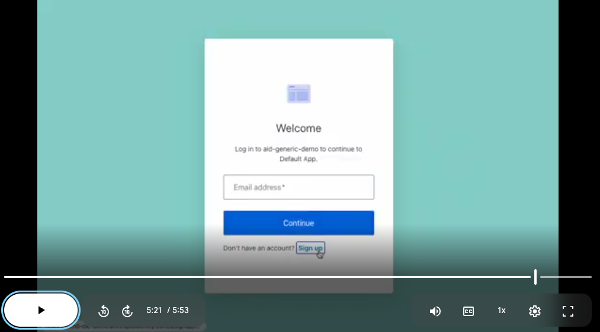

# ULP Page Template

Deploys a Universal Login page template to an Auth0 tenant via the Management API. To test, you must:

- Configure a custom domain for the tenant
- Load the login page on the custom domain, not the `auth0` domain

## Templates

- **[Testing template](./template.liquid)** - Testing template that changes the background color and logs a message in the console.
- **[Application logos](./template.app-logos.liquid)** - Shows the application logo, if one is saved for the application requesting login, falling back to the main tenant logo. [Demo video ›](https://drive.google.com/file/d/131S6rn4zMk-QREYHcqwtUK5CczoT42d1/view?usp=drive_link)
- **[Hide password confirmation](./template.omit-password-confirm.liquid)** - Hides the password confirmation field when resetting a password. [Demo video ›](https://drive.google.com/file/d/1jAERaOb22H2Rl7-CG5wHRY7PDigTyDbw/view?usp=sharing)
- **[Remember email address](./template.omit-password-confirm.liquid)** - Keeps the email address entered in the field when switching between login and signup. [Demo video ›](https://drive.google.com/file/d/13hVJIB7DXBqCVYPlAkSKEkwosRvDRa0n/view?usp=sharing)

## Usage

Watch the demo video for a walk-through:

[](https://drive.google.com/file/d/1UnYCBE7wiwhTL36IrmhYY6csoRudLP-G/view?usp=sharing)

First, setup a [Custom Domain](https://auth0.com/docs/customize/custom-domains) for your tenant.

Next, [create a machine-to-machine application](https://auth0.com/docs/get-started/auth0-overview/create-applications/machine-to-machine-apps) authorized for the Management API with at least the `get:branding`, `update:branding`, and `delete:branding` scopes, based on the actions you want to take.

Copy `.env.example` to `.env` and fill in these values using the application above:

- `AUTH0_DOMAIN`: tenant domain (e.g. `example.auth0.com`)
- `AUTH0_CLIENT_ID`: client ID from the application above
- `AUTH0_CLIENT_SECRET`: client secret from the application above

Install dependencies:

```bash
npm install
```

Check the current page template:

```bash
npm run get
```

Edit `template.liquid` as needed then push to the tenant:

```bash
npm run put
```

This pushes the contents of `template.liquid` to your tenant's Universal Login template.

Finally, load a login page on the custom domain (not the `auth0` domain) to see the changes. 

If you need to delete the template:

```bash
npm run delete
```

## References

- [Customize ULP templates](https://auth0.com/docs/customize/login-pages/universal-login/customize-templates)
- [Management API — GET universal login](https://auth0.com/docs/api/management/v2/branding/get-universal-login)
- [Management API — PUT universal login](https://auth0.com/docs/api/management/v2/branding/put-universal-login)
- [Management API — DELETE universal login](https://auth0.com/docs/api/management/v2/branding/delete-universal-login)
